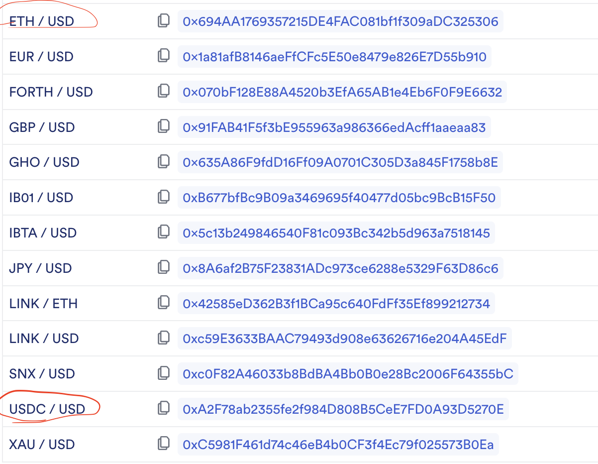

## DealEngine(todo check my understanding is right? Based on the relative increased percent, Is it Fair?)

### Rules: How to send the profit the corresponding user?

- 1. Current only support deposited USDC, then no matter opener or pairer, the USDC they deposited must be greater than
     the legToken market value
     - todo check.
     - 1: For the opener, Does opener deposit the USDC when openSwap or EquitySwap transfer the USDC to the contract
       itself when the pairer pair the swap(second form should using signature, which specify the endtime)
     - 2: Only support USDC or many other stable Tokens?
     - 3: User can directly deposited the legToken instead of depositing USDC? support this form?
     - 4: How much of the minimum value when openSwap?

- 2. When pairer pair the swap, the deposted USDC must greater than pairer's total USDC value.

- 3. The first benchPrice was based on the startDate of the leg

- 4. The following comparision(newPrice and last benchPrice) based on the endDate(or the fixDate1... if added)

- 5. USDC problem?
  - Current online price as this: ETH/USD, USDC/USD, and now only support USDC as the settle stableCoin. if USDC != USD,
    how to deal with this situation? 

### Cases

1.  case1

    1.1. startDate: opener: 1 BTC, actual value: 10,000; pairer: 10,000 USDC

    1.2. endDate: BTC increase: 5%. Now BTC market value: 10,500, USDC price don't change. the relative increase rates
    of the BTC comparing to the USDC: 5%.

    - 5% \* 10,000 = 500 USDC to BTC depositer.

      1.3. updating opener: 1 BTC, actual value: 10,500; pairer: 9,500 USDC

1.  case2

    2.1 startDate: opener: 1 BTC, actual value: 10,000; pairer: 5,000 USDC

    2.2 endDate: BTC increase: 5%. Now BTC market value: 10,500, USDC price don't change.

    - DealEngine: 5% \* 5,000 = 250 USDC to BTC depositer.

      2.3. updating opener: 1 BTC, actual value: 10,500; pairer: 4,750 USDC
