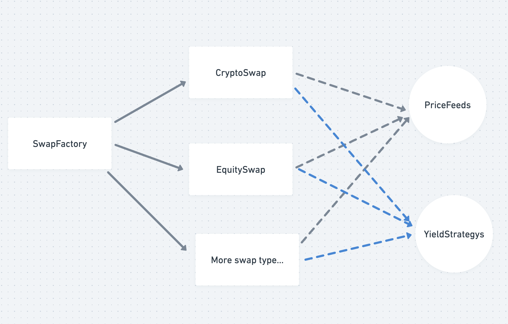

# **Basic Intro**

**Panda Finance** brings traditional finance swaps to the blockchain. This exposes a wider range of assets, including
both crypto and traditional assets, making derivative tools more accessible to a broader audience and lowering the
barrier for many people to use these powerful financial instruments.

# **What Panda Finance do?**

### **The definition of “_Swaps in_ Finance”**

> _Swaps in finance involve a contract between two or more parties on a derivative contract which involves an exchange
> of cash flow based on a predetermined notional principal amount, which usually includes interest rate swaps which is
> the exchange of floating rate interest with a fixed rate of interest and the currency swaps which is the exchange of
> fixed currency rate of one country with floating currency rate of another country etc._

- reference: [swaps-finance](https://www.wallstreetmojo.com/swaps-finance/)

### **Advantages of Panda Finance**

1. **Support More Assets**
   - Traditional finance swaps typically involve exchanging fixed interest rates with floating interest rates, different
     stocks, or various fiat currencies. Panda Finance expands this by supporting a broader range of assets, including
     crypto and traditional assets. Users can also configure their desired assets.
2. **No Broker, Low Fees**
   - Every deal is hardcoded into the swap contract, ensuring execution according to the code and eliminating the need
     for brokers. This leads to lower fees.
3. **Low Barrier to Entry**
   - Panda Finance makes it easy for everyone to use these tools. Users can start with a minimal deposit, unlike
     traditional derivatives finance tools that often require significant capital and are typically used by large
     companies.
4. **Meeting User Needs, Even Niche Demands**
   - Panda Finance supports peer-to-contract interactions, allowing users to satisfy a wide range of needs, including
     niche demands.

### **How Panda Finance Works**

1. **Selecting or Opening a Leg**
   - Users can choose an active leg on the website or open a new leg.
2. **Opening a New Leg**
   - **Select Asset**: Choose an asset, such as ETH or AAPL.
   - **Select Notional Amount**: select one options like $10 or $100. Users can also create multiple legs, like 5 legs
     worth $10 each.
   - **Select Period Type**: Weekly, Monthly, Quarterly, or Yearly.
   - **Set End Date**: Define the swap's end date.
   - **Deposit USDC**: Deposit an amount equal to the corresponding notional amount. (In the future, leverage ratios
     will allow users to deposit a fraction (e.g., 1/10) of the value to open a leg. todo)
   - **Select Yield Strategies**: Choose strategies like Yearn to earn profits during the swap period.
3. **Quick Swap Start**
   - **Pair with Existing Leg**: Select an active leg (e.g., ETH to BTC).
   - **Select Bet Asset**: Choose an asset like BTC and deposit the required amount.
   - **Update Benchmark Price**: The system updates the benchmark price.
4. **Withdraw Profits**
   - After each period or the swap's end, the winner can manually withdraw their profit. Automated withdrawals are also
     supported if the user selects this option.
5. **End of Swap**
   - At the swap's conclusion, users receive their principal and yield profit

# **Glossary of terms**

- [EquitySwapIntro](EquitySwapIntro.md)

# **Chainlink Services Used**

1. pairSwap
   - get all token's bench price
2. settleSwap
   - get all token's latest price/ or history tokens’s price
   - support automation? (when user config todo)

# **contracts design(todo add more details)**

