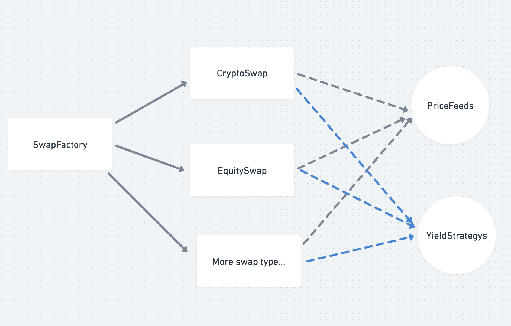

## todo list

1. profit calculation is wrong when all all legs's price are down. like leg1 -7%, leg2 -8%

2. Management the ownerships for priceFeeds,YieldStrategies,CryptoSwap

3. more cases test, such as user cancelled leg

4. add breef to YieldStrategies

5. add query history price logic in settleSwap

6. Now user deposited USDC equal notionalaAmount.

   1. should supply leverage ration? such as user deposit 10% of notionalaAmount to open the leg?

7. settleSwap add different period time logic

8. add fees while dealing one settle. 0.003.

9. The ultimate design as below.
   1. swapFactory can create different type swap contract, now support cryptoSwap. the following support includes
      EquitySwap, ratesSwap
   2. all SwapContract will use the features ofX priceFeeds and YieldStrategies contract.

